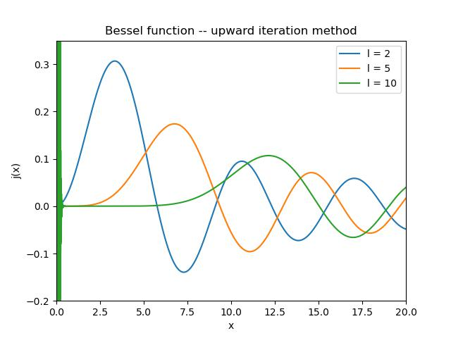
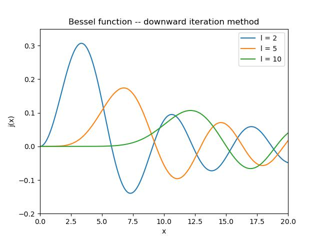
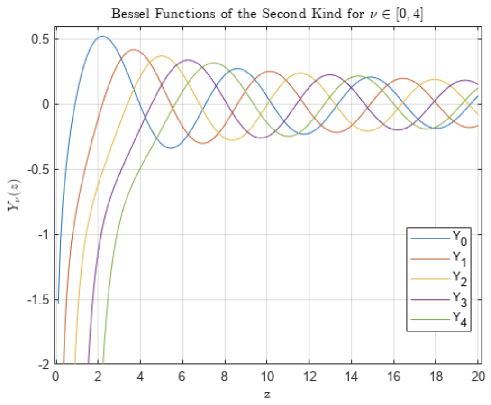

# 计算物理作业2

## 1.球贝赛尔函数的迭代求解

分离变量法求解偏微分方程式时，例如球坐标下的热传导方程、拉普拉斯方程等，常见的球贝塞尔函数可以写成：

$$
x^2\ddot{f} + 2x\dot{f} +[x^2−l(l+ 1)]f = 0\tag{1}
$$

其零阶和一阶可以直接求解得到：

$$
j_0(x) =sinx/x\tag{2}
$$

$$
j_1(x) =sinx/x^2−cosx/x\tag{3}
$$

利用向上和向下的迭代关系式：

$$
j_{l+1}(x) =\frac{2l+1}{x}j_l(x)−j_{l−1}(x)\tag{4}
$$

$$
j_{l−1}(x) =\frac{2l+1}{x}j_l(x)-j_{l+1}(x)\tag{5}
$$

(a)请写一段向上和向下迭代的程序，数值求解得到$l= 2,5,10$阶的球贝塞尔函数并画图 $x∈(0.0,20.0)$
(b)评估哪一种形式的算法更好，并给出原因。

### 题解1：

#### (a)

##### 向上迭代：

由向上迭代的递推逻辑，先构造第0阶与第1阶的球贝赛尔函数，代码如下：

```python
def j_0(x):
    '''
    0th order Bessel function
    '''
    if x == 0:
        y = 1
    else:
        y = math.sin(x)/x
    return y


def j_1(x):
    '''
    1st order Bessel function
    '''
    if x == 0:
        y = 0
    else:
        y1 = math.sin(x)/x**2
        y2 = math.cos(x)/x
        y = y1-y2
    return y
```

构造求解区间内的自变量数组，再利用for循环对于每一个需要求值的横坐标进行遍历，将求出的值利用递推关系进行迭代，将所有需要的值存入一个二维数组中，其外层代表第k阶的贝赛尔函数，内层代表与横坐标对应的各个贝赛尔函数值，代码如下：

```Python
def BesselUpward(x_list, l_max):
    '''
    The specific calculation of the Bessel function using upward method
    Args:
        x_list (list[float]): The x array to be calculated
        l_max (int): The highest order of the Bessel function to be computed
    Returns:
        DataSet: A two-dimensional array, each outer element represents the corresponding 
			point value of the l-th order Bessel function
    '''
    DataSet = []  # A two-dimensional data set for storing curves
    for l in range(l_max+1):
        y_l = []
        n = 0
        for x in x_list:
            if l == 0:
                y = j_0(x)
            if l == 1:
                y = j_1(x)
            if l >= 2:
                # Solve using recurrence relation
                y = (2*l-1)*DataSet[l-1][n]/x - DataSet[l-2][n]
                n += 1
            y_l.append(y)
        DataSet.append(y_l)
    return DataSet
```

最后，根据得到的各阶贝赛尔函数点列，利用matplotlib画图即可，得到向上迭代的结果如图所示，此时调整图像的显示区间可以看到使用该方法函数图像在原点附近的发散现象，其原因将在问题(b)中说明。



##### 向下迭代：

此时面临的一个重要问题是如何确定自上而下递推的初始值，其实初始值可以任意选取，只要初始所处的阶数相比于需要的阶数大上很多就行，原因可以从递推关系式（5）中看出，在这个递推关系中关于贝赛尔函数是齐次的，也就是说给贝赛尔函数整体乘上一个定值递推关系不发生变化，现在第0阶贝赛尔函数是已知的，也就是说只要将递推出的各阶贝赛尔函数值做如下变换即可：

$$
j_l^{true}=j_l^{cauculate}\frac{j_0^{true}}{j_0^{cauculate}}\tag{6}
$$

从（6）式出发，向下迭代法的具体思路如下：

首先对于递推关系式（5），稍作变换可得：

$$
j_{l}(x) =\frac{2l+3}{x}j_{l+1}(x)-j_{l+2}(x)\tag{7}
$$

做代换

$$
l=l_{max}-k\tag{8}
$$

可得：

$$
J_{k}(x) =\frac{2(l_{max}-k)+3}{x}J_{k-1}(x)-J_{k-2}(x)\tag{9}
$$

其中

$$
J_k(x)=j_{(l_{max}-k)}(x)=j_l(x)
$$

至此，问题就变得与向上迭代法非常类似了，具体的代码如下：

```python
def j_0_star(x):
    '''
    Reciprocal 0th order Bessel function for backpropagation
    '''
    y = 1
    return y


def j_1_star(x):
    '''
    Reciprocal first order Bessel function
    '''
    y = 1
    return y
```

这两者只要不全为0即可，对应初始贝赛尔函数，递推求解贝赛尔函数点列代码如下：

```python
def BesselDownward(x_list, l_max):
    '''
    The specific calculation of the Bessel function using downward method
    Normalization by the 0th order Bessel function using relative value invariance
    Args:
        x_list (list[float]): The x array to be calculated
        l_max (int): The highest order of the Bessel function to be computed
    Returns:
        DataSet: A two-dimensional array, each outer element represents the corresponding point value of the l-th order Bessel function
    '''
    DataSet = []  # A two-dimensional data set for storing curves
    for k in range(l_max+1):
        y_k = []
        n = 0
        for x in x_list:
            if k == 0:
                y = j_0_star(x)
            if k == 1:
                y = j_1_star(x)
            if k >= 2:
                # Solve using recurrence relation
                y = (2*(l_max-k)+3)*DataSet[k-1][n]/x - DataSet[k-2][n]
                n += 1
            y_k.append(y)
        DataSet.append(y_k)
    # Normalized
    for k in range(l_max+1):
        n = 0
        for Bessel_y_k in DataSet[k]:
            DataSet[k][n] = Bessel_y_k * j_0(x_list[n])/DataSet[l_max][n]
            n += 1
  
    return DataSet
```

求出DataSet后利用matplotlib画图，可以得到无发散的图像如图所示：



可以看到比使用向上传播的方法好上很多。

#### (b)

##### 结论：

由结果可以看出，使用向下迭代法可以避免函数在原点附近的发散，对于求解高阶的球贝赛尔函数有很大好处，同时向上迭代法也有自身的优点，在计算较为低阶的球贝赛尔函数时可以更快地得到结果，但应尽量避免在原点附近取值。

##### 原因：

在使用向上迭代法时，会产生上课时所讲的“误差病态传播"现象，迭代关系（4）式对应的两项之差在原点附近会造成误差爆炸，事实上，与球贝赛尔方程对应的解还有诺伊曼函数，如图所示：



（图片来自Matlab官方）

在计算的过程中，对于每一次迭代求解，均相当于引入了一个小量误差：

$$
j_n(x)^{cauculate}=j_n(x)^{true}+\delta*y_n(x)^{true}
$$

由于诺伊曼函数在原点处发散，虽然误差仅为一个小量，但乘上无穷大后叠加起来就造成了原点附近图像的扭曲。在向下迭代的算法中，避免了减法导致的相消，同时利用0阶贝赛尔函数进行修正，得到了较好的结果。因此，从这个例子中可以看出，迭代计算时尽量从“小"开始求得“大"量，而不是从“大"量开始求取“小"量。程序的源码在文件./2_1.py中。
