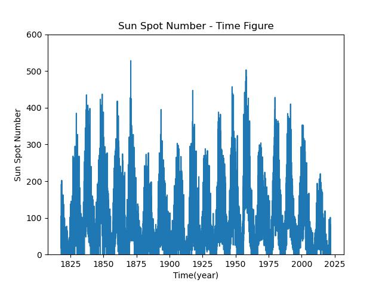
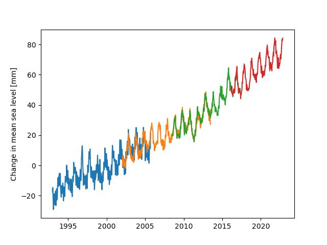

# 计算物理作业3

原题见homework-2023-3.pdf

## 1.太阳黑子数据可视化

### 题解1:

使用np.loadtxt读取数据后用pandas转换为dataframe画图即可，代码如下：

```python
import pandas as pd
import numpy as np
import matplotlib.pyplot as plt


def main():
    data = np.loadtxt('作业3/SunSpot.txt', float)
    Data = pd.DataFrame(data)
    Data = Data[Data[4]!= -1.0]
    plt.plot(Data[3], Data[4])
    plt.xlabel('Time(year)')
    plt.ylabel('Sun Spot Number')
    plt.ylim([0, 600])
    plt.title('Sun Spot Number - Time Figure')
    plt.savefig('./作业3/ResultSunSpot.jpg')
    return 0


if __name__ == "__main__":
    main()
```

最终结果如下:



## 2.气候变化的海平面数据

### 题解2：

使用pandas读取数据分析即可，注意前面几行标题说明去掉即可，代码如下：

```python
import pandas as pd
import matplotlib.pyplot as plt

def main():
    Data = pd.read_csv('./作业3/SeaLevel.csv', skiprows= 5, header=None)  # 前几行不用读取
    for i in range(1,5):
        temp = Data.dropna(subset=[i], axis= 0)
        plt.plot(temp[0], temp[i])
    plt.ylabel("Change in mean sea level [mm]")
    plt.savefig("./作业3/ResultSeaLevel.jpg")
    return 0

if __name__ == '__main__':
    main()
```

最终结果如下：


