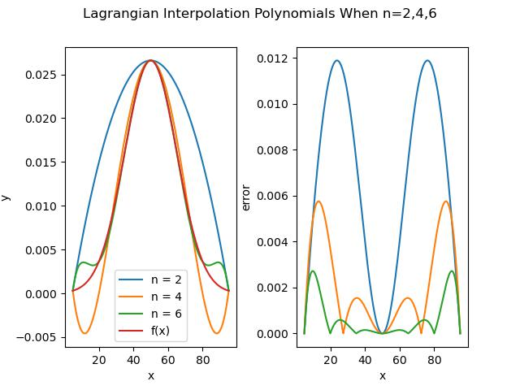

# 计算物理作业4

原题见homework-2023-4.pdf

## 1.拉格朗日插值的实现

在分析的时候理清关系即可，首先定义原始的高斯函数：

```python
def f(x):
    # 原高斯函数
    a = 50 # x的均值
    b = 15 # x的方差
    m = -(x-a)**2/(2*b**2)
    y = (1/(b*math.sqrt(2*math.pi)))*math.exp(m)
    return y
```

接着定义拉格朗日插值方法，这里需要注意循环，多调试一下代码观察一下向量维度即可。

```python
def LagInter(x ,y):
    '''
    Lagrangian interpolation

    input: 
        x[list] y[list] 输入需要插值的坐标组
    output:
        Lag_y[list] 由插值多项式计算出的纵坐标
    '''
    line_x = np.arange(min(x), max(x), 0.001).tolist()
    Lag_y = []
    for line_x_i in line_x:
        Lag_y_i = 0
        for k in range(0, len(x)):
            y_l_k = 1
            for j in range(0, len(x)):
                if j == k:
                    y_l_k = y_l_k  # 相当于乘上1
                else:
                    y_l_k = y_l_k * (line_x_i-x[j])/(x[k]-x[j])  
            Lag_y_i += y_l_k*y[k]
        Lag_y.append(Lag_y_i)
    return Lag_y
```

最后是主函数，主要实现两个功能，一个是画图，另一个是在精度满足要求时弹出。代码如下：

```Python
def main():
    x_0 = 5.0
    x_n = 95.0
    n_list = [2, 4, 6]
    n = 2
    max_error = 0.0005
    line_y = []
    for x in np.arange(x_0, x_n, 0.001).tolist():
        y = f(x)
        line_y.append(y)
    while True:
        step = (x_n-x_0)/n
        x = np.arange(x_0, x_n + step, step).tolist()
        y = []
        for x_i in x:
            y_i = f(x_i)
            y.append(y_i)
        Lag_y = LagInter(x, y)
        line_x = np.arange(min(x), max(x), 0.001).tolist()
        error = []
        for k in range(len(Lag_y)):
            error.append(np.abs(Lag_y[k]-line_y[k]))
        if n in n_list:
            plt.subplot(1, 2, 1)
            plt.plot(line_x, Lag_y, label="n = " + str(n))
            plt.subplot(1, 2, 2)
            plt.plot(line_x, error, label="n = " + str(n))
        if max(error) <= max_error:
            print('最大误差为 %f  要求n至少为 %d' %(max_error, n))
            break
        n += 1
    plt.subplot(1, 2, 1)
    plt.plot(line_x, line_y, label="f(x)")
    plt.legend()
    plt.xlabel("x")
    plt.ylabel("y")
    plt.subplot(1, 2, 2)
    plt.xlabel("x")
    plt.ylabel("error")
    plt.suptitle("Lagrangian Interpolation Polynomials When n=2,4,6")
    # 设置子图间距
    plt.subplots_adjust(wspace = 0.35)
    plt.savefig('./作业4/Result_a.jpg')
    plt.close()
    return 0
```

最终得到的结果为：

0.0005的精度至少要求n =10

作图如下：


